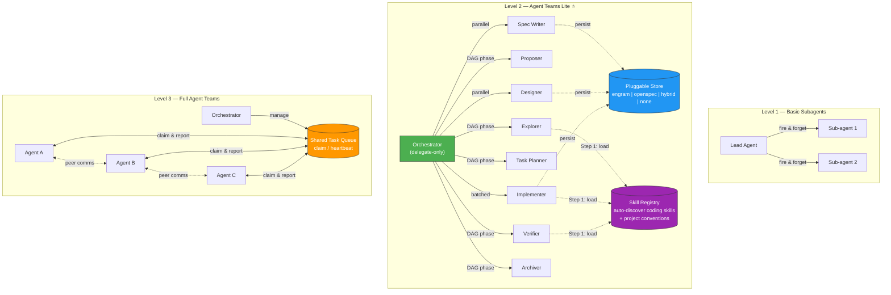

<p align="center">
  <h1 align="center">Agent Teams Lite</h1>
  <p align="center">
    <strong>Agent-Team Orchestration with AI Sub-Agents</strong>
    <br />
    <em>An orchestrator + specialized sub-agents for structured feature development.</em>
    <br />
    <em>Zero dependencies. Pure Markdown. Works everywhere.</em>
  </p>
</p>

<p align="center">
  <a href="#quick-start">Quick Start</a> &bull;
  <a href="#how-it-works">How It Works</a> &bull;
  <a href="#commands">Commands</a> &bull;
  <a href="#installation">Installation</a> &bull;
  <a href="#releases">Releases</a> &bull;
  <a href="#supported-tools">Supported Tools</a>
</p>

---

## The Problem

AI coding assistants are powerful, but they struggle with complex features:

- **Context overload** — Long conversations lead to compression, lost details, hallucinations
- **No structure** — "Build me dark mode" produces unpredictable results
- **No review gate** — Code gets written before anyone agrees on what to build
- **No memory** — Specs live in chat history that vanishes

## The Solution

**Agent Teams Lite** is an agent-team orchestration pattern where a lightweight coordinator delegates all real work to specialized sub-agents. Each sub-agent starts with fresh context, executes one focused task, and returns a structured result.

```
YOU: "I want to add CSV export to the app"

ORCHESTRATOR (delegate-only, minimal context):
  → launches EXPLORER sub-agent     → returns: codebase analysis
  → shows you summary, you approve
  → launches PROPOSER sub-agent     → returns: proposal artifact
  → launches SPEC WRITER sub-agent  → returns: spec artifact
  → launches DESIGNER sub-agent     → returns: design artifact
  → launches TASK PLANNER sub-agent → returns: tasks artifact
  → shows you everything, you approve
  → launches IMPLEMENTER sub-agent  → returns: code written, tasks checked off
  → launches VERIFIER sub-agent     → returns: verification artifact
  → launches ARCHIVER sub-agent     → returns: change closed
```

**The key insight**: the orchestrator NEVER does real work directly — not just SDD phases, but ANY task. It delegates everything to sub-agents, tracks state, and synthesizes summaries. This keeps the main thread small and stable. For substantial features, it uses the SDD workflow (structured DAG of phases). For smaller tasks, it still delegates to a general sub-agent.

**Sub-agents auto-discover your skills.** If you have coding skills installed (React, TDD, Playwright, Django, etc.), sub-agents automatically load the relevant ones before writing code. A [skill registry](#skill-registry) catalogs your skills and project conventions so every sub-agent knows what patterns to follow — even though it starts with a fresh context.

### Persistence Is Pluggable

The workflow engine is storage-agnostic. Artifacts can be persisted in:

- `engram` (recommended default) — https://github.com/gentleman-programming/engram
- `openspec` (file-based, optional)
- `hybrid` (both Engram + OpenSpec simultaneously)
- `none` (ephemeral, no persistence)

Default policy is conservative:

- If Engram is available, persist to Engram (recommended)
- If user explicitly asks for file artifacts, use `openspec`
- If user wants both cross-session recovery AND local files, use `hybrid`
- Otherwise use `none` (no writes)
- `openspec` and `hybrid` are NEVER chosen automatically — only when the user explicitly asks

### Quick Modes

Recommended defaults by use case:

```yaml
# Agent-team storage policy
artifact_store:
  mode: engram      # Recommended: persistent, repo-clean
```

```yaml
# Privacy/local-only (no persistence)
artifact_store:
  mode: none
```

```yaml
# File artifacts in project (OpenSpec flow)
artifact_store:
  mode: openspec
```

```yaml
# Both backends: cross-session recovery + local files (uses more tokens)
artifact_store:
  mode: hybrid
```

---

## How It Works

### Where Agent Teams Lite Fits

Agent Teams Lite sits between basic sub-agent patterns and full Agent Teams runtimes:



| Capability | Basic Subagents | Agent Teams Lite | Full Agent Teams |
|---|:---:|:---:|:---:|
| Delegate-only lead | — | ✅ | ✅ |
| DAG-based phase orchestration | — | ✅ | ✅ |
| Parallel phases (spec ∥ design) | — | ✅ | ✅ |
| Structured result envelope | — | ✅ | ✅ |
| Pluggable artifact store | — | ✅ | ✅ |
| **Skill auto-discovery** | — | ✅ | ✅ |
| Shared task queue with claim/heartbeat | — | — | ✅ |
| Teammate ↔ teammate communication | — | — | ✅ |
| Dynamic work stealing | — | — | ✅ |

### Architecture

```
┌──────────────────────────────────────────────────────────┐
│  ORCHESTRATOR (coordinator — never does real work)         │
│                                                           │
│  Responsibilities:                                        │
│  • Delegate ALL tasks to sub-agents (not just SDD)        │
│  • Launch sub-agents via Task tool                        │
│  • Show summaries to user                                 │
│  • Ask for approval between phases                        │
│  • Track state: which artifacts exist, what's next        │
│  • Suggest SDD for substantial features/refactors         │
│                                                           │
│  Context usage: MINIMAL (only state + summaries)          │
└──────────────┬───────────────────────────────────────────┘
               │
               │ Task(subagent_type: 'general', prompt: 'Read skill...')
               │
    ┌──────────┴──────────────────────────────────────────┐
    │                                                      │
    ▼          ▼          ▼         ▼         ▼           ▼
┌────────┐┌────────┐┌────────┐┌────────┐┌────────┐┌────────┐
│EXPLORE ││PROPOSE ││  SPEC  ││ DESIGN ││ TASKS  ││ APPLY  │ ...
│        ││        ││        ││        ││        ││        │
│ Fresh  ││ Fresh  ││ Fresh  ││ Fresh  ││ Fresh  ││ Fresh  │
│context ││context ││context ││context ││context ││context │
└───┬────┘└───┬────┘└───┬────┘└───┬────┘└───┬────┘└───┬────┘
    │         │         │         │         │         │
    └─────────┴─────────┴────┬────┴─────────┴─────────┘
                             │
                    Step 1: load skills
                             │
                 ┌───────────▼───────────┐
                 │    SKILL REGISTRY     │
                 │                       │
                 │ • Your coding skills  │
                 │   (React, TDD, etc.)  │
                 │ • Project conventions │
                 │   (agents.md, etc.)   │
                 └───────────────────────┘
```

### The Dependency Graph

```
                    proposal
                   (root node)
                       │
         ┌─────────────┴─────────────┐
         │                           │
         ▼                           ▼
      specs                       design
   (requirements                (technical
    + scenarios)                 approach)
         │                           │
         └─────────────┬─────────────┘
                       │
                       ▼
                    tasks
                (implementation
                  checklist)
                       │
                       ▼
                    apply
                (write code)
                       │
                       ▼
                    verify
               (quality gate)
                       │
                       ▼
                   archive
              (merge specs,
               close change)
```

### Sub-Agent Result Contract

Each sub-agent should return a structured payload with variable depth:

```json
{
  "status": "ok | warning | blocked | failed",
  "executive_summary": "short decision-grade summary",
  "detailed_report": "optional long-form analysis when needed",
  "artifacts": [
    {
      "name": "design",
      "store": "engram | openspec | hybrid | none",
      "ref": "observation-id | file-path | null"
    }
  ],
  "next_recommended": ["tasks"],
  "risks": ["optional risk list"]
}
```

`executive_summary` is intentionally short. `detailed_report` can be as long as needed for complex architecture work.

### Artifact Persistence (Optional)

When `openspec` mode is enabled, a change can produce a self-contained folder:

```
openspec/
├── config.yaml                        ← Project context (stack, conventions)
├── specs/                             ← Source of truth: how the system works TODAY
│   ├── auth/spec.md
│   ├── export/spec.md
│   └── ui/spec.md
└── changes/
    ├── add-csv-export/                ← Active change
    │   ├── proposal.md                ← WHY + SCOPE + APPROACH
    │   ├── specs/                     ← Delta specs (ADDED/MODIFIED/REMOVED)
    │   │   └── export/spec.md
    │   ├── design.md                  ← HOW (architecture decisions)
    │   └── tasks.md                   ← WHAT (implementation checklist)
    └── archive/                       ← Completed changes (audit trail)
        └── 2026-02-16-fix-auth/
```

---

## Quick Start

### 1. Install the skills

```bash
git clone https://github.com/gentleman-programming/agent-teams-lite.git
cd agent-teams-lite
./scripts/install.sh
```

The installer asks which tool you use and copies skills to the right location.

### 2. Add the orchestrator to your agent

See [Installation](#installation) for your specific tool.

### 3. Use it

Open your AI assistant in any project and say:

```
/sdd-init
```

Then start building:

```
/sdd-new add-csv-export
```

Or let it detect automatically — describe a substantial feature and the orchestrator will suggest SDD.

---

## Releases

We publish versioned release notes on GitHub:

- https://github.com/Gentleman-Programming/agent-teams-lite/releases

Latest release:

- `v3.3.1` — Skill registry skill, engram-first discovery, inline persistence in all skills.
- `v3.3.0` — Mandatory persist steps, initial skill registry, knowledge persistence for non-SDD sub-agents.
- `v3.2.3` — Inline engram instructions in all skills and agent configs (fixes 3-hop file read chain bug).

---

## Commands

| Command | What It Does |
|---------|-------------|
| `/sdd-init` | Initialize SDD context. Detects stack, bootstraps persistence, builds skill registry. |
| `/sdd-explore <topic>` | Investigate an idea. Reads codebase, compares approaches. No files created. |
| `/sdd-new <name>` | Start a new change by delegating exploration + proposal to sub-agents. |
| `/sdd-continue` | Run the next dependency-ready phase via sub-agent(s). |
| `/sdd-ff <name>` | Fast-forward planning with sub-agents (proposal → specs → design → tasks). |
| `/sdd-apply` | Implement tasks in batches. Checks off items as it goes. |
| `/sdd-verify` | Validate implementation against specs. Reports CRITICAL / WARNING / SUGGESTION. |
| `/sdd-archive` | Close a change and persist final state in the active artifact store. |
| `/skill-registry` | Create or update the skill registry for the current project. |

### Example Flow

```
You: /sdd-new add-dark-mode

AI:  Launching explorer sub-agent...
     ✓ Codebase analyzed. React + Tailwind detected.
     ✓ Current theme: hardcoded light mode in globals.css
     
     Launching proposal sub-agent...
     ✓ proposal.md created
       Intent: Add dark mode toggle with system preference detection
       Scope: Theme context, toggle component, CSS variables
     
     Want me to continue with specs and design? (or review the proposal first)

You: Go ahead

AI:  ✓ specs/ui/spec.md — 3 requirements, 7 scenarios
     ✓ design.md — CSS variables approach, React Context, localStorage
     ✓ tasks.md — 3 phases, 8 tasks
     
     Ready to implement. Run /sdd-apply to start.

You: /sdd-apply

AI:  Implementing Phase 1 (Foundation)...
     ✓ Loaded skills: react-19, typescript, tailwind-4
     ✓ 1.1 Created ThemeContext (React 19 patterns, no useMemo needed)
     ✓ 1.2 Added CSS custom properties via Tailwind theme
     ✓ 1.3 Added localStorage persistence

     3/8 tasks complete. Continue with Phase 2?
```

---

## The Sub-Agents

Each sub-agent is a SKILL.md file — pure Markdown instructions that any AI assistant can follow. All sub-agents load the [skill registry](#skill-registry) as Step 1 before starting work.

| Sub-Agent | Skill File | What It Does |
|-----------|-----------|-------------|
| **Init** | `sdd-init/SKILL.md` | Detects project stack, bootstraps persistence, builds skill registry |
| **Explorer** | `sdd-explore/SKILL.md` | Reads codebase, compares approaches, identifies risks |
| **Proposer** | `sdd-propose/SKILL.md` | Creates `proposal.md` with intent, scope, rollback plan |
| **Spec Writer** | `sdd-spec/SKILL.md` | Writes delta specs (ADDED/MODIFIED/REMOVED) with Given/When/Then |
| **Designer** | `sdd-design/SKILL.md` | Creates `design.md` with architecture decisions and rationale |
| **Task Planner** | `sdd-tasks/SKILL.md` | Breaks down into phased, numbered task checklist |
| **Implementer** | `sdd-apply/SKILL.md` | Writes code following specs and design, marks tasks complete. v2.0: TDD workflow support |
| **Verifier** | `sdd-verify/SKILL.md` | Validates implementation against specs with real test execution. v2.0: spec compliance matrix |
| **Archiver** | `sdd-archive/SKILL.md` | Merges delta specs into main specs, moves to archive |
| **Skill Registry** | `skill-registry/SKILL.md` | Scans user skills + project conventions, writes `.atl/skill-registry.md` |

### Shared Conventions

All skills reference three shared convention files in `skills/_shared/`. Critical engram calls (`mem_search`, `mem_save`, `mem_get_observation`) are also **inlined directly in each skill** so sub-agents don't need to follow multi-hop file references.

| File | Purpose |
|------|---------|
| `persistence-contract.md` | Mode resolution rules, sub-agent context protocol, skill registry loading protocol |
| `engram-convention.md` | Supplementary reference for deterministic naming (`sdd/{change-name}/{artifact-type}`) and two-step recovery. Critical calls are inlined in skills. |
| `openspec-convention.md` | Filesystem paths for each artifact, directory structure, config.yaml reference, and archive layout |

**Why inline + shared:**
- **Sub-agents fail multi-hop chains** — A 3-hop read chain (skill → convention file → actual instructions) breaks non-Claude models. Inlining the critical calls eliminates this.
- **Deterministic recovery** — Engram artifact naming follows a strict `sdd/{change}/{type}` convention with `topic_key`, so any skill can reliably find artifacts created by other skills.
- **Consistent mode behavior** — All skills resolve `engram | openspec | hybrid | none` the same way. `openspec` and `hybrid` are never chosen automatically.

### Skill Registry

Sub-agents start with a **fresh context** — they don't know what user skills exist (React, TDD, Playwright, etc.). The skill registry solves this.

**How it works:**
1. `/sdd-init` or `/skill-registry` scans your installed skills and project conventions
2. Writes `.atl/skill-registry.md` in the project root (mode-independent, always created)
3. If engram is available, also saves to engram (cross-session bonus)
4. Every sub-agent reads the registry as **Step 1** before starting any work

**Read priority:** Engram first (fast, survives compaction) → `.atl/skill-registry.md` as fallback.

**What it contains:**
- User skills table: trigger → skill name → path (e.g., "React components" → `react-19` → `~/.claude/skills/react-19/SKILL.md`)
- Project conventions found: `agents.md`, `CLAUDE.md`, `.cursorrules`, etc.

**When to update:** Run `/skill-registry` after installing or removing skills.

### Notable Upgrades

**v2.0 — TDD + Real Execution:**
- **sdd-apply v2.0** — TDD workflow support. RED-GREEN-REFACTOR cycle when enabled via config.
- **sdd-verify v2.0** — Real test execution + spec compliance matrix (PASS/FAIL/SKIP per requirement).

**v3.2.3 — Inline Engram Persistence:**
- All 9 SDD skills now have critical engram calls (`mem_search`, `mem_save`, `mem_get_observation`) inlined directly in their numbered steps. Sub-agents no longer need to follow a 3-hop file read chain to find persistence instructions.

**v3.3.0 — Mandatory Persist Steps + Knowledge Persistence:**
- Every skill has an explicit numbered "Persist Artifact" step — models were ignoring the contract section and skipping persistence. Now it's impossible to miss.
- Non-SDD sub-agents are instructed to save discoveries, decisions, and bug fixes to engram automatically.

**v3.3.1 — Skill Registry:**
- New `skill-registry` skill for creating/updating the registry on demand.
- All sub-agents load the skill registry as **Step 1** — they now know about your coding skills (React, TDD, Playwright, etc.) and project conventions.
- Engram-first + `.atl/skill-registry.md` fallback — works with or without engram.

---

## Installation

Dedicated setup guides for all supported tools:

- [Claude Code](#claude-code) — Full sub-agent support via Task tool
- [OpenCode](#opencode) — Full sub-agent support via Task tool
- [Gemini CLI](#gemini-cli) — Inline skill execution
- [Codex](#codex) — Inline skill execution
- [VS Code (Copilot)](#vs-code-copilot) — Agent mode with context files
- [Antigravity](#antigravity) — Native skill support with `~/.gemini/antigravity/skills/` and `.agent/` paths
- [Cursor](#cursor) — Inline skill execution

### Claude Code

**1. Copy skills:**

```bash
# Using the install script
./scripts/install.sh  # Choose option 1: Claude Code

# Or manually
cp -r skills/_shared skills/sdd-* skills/skill-registry ~/.claude/skills/
```

**2. Add orchestrator to `~/.claude/CLAUDE.md`:**

Append the contents of [`examples/claude-code/CLAUDE.md`](examples/claude-code/CLAUDE.md) to your existing `CLAUDE.md`.

The example is intentionally lean to avoid token bloat in always-loaded system prompts. Critical engram calls are inlined in each skill file.

This keeps your existing assistant identity and adds SDD as an orchestration overlay.

The orchestrator instructions teach Claude Code to:
- Detect SDD triggers (`/sdd-new`, feature descriptions, etc.)
- Launch sub-agents via the Task tool
- Pass skill file paths so sub-agents read their instructions
- Track state between phases

**3. Verify:**

Open Claude Code and type `/sdd-init` — it should recognize the command.

---

### OpenCode

**1. Copy skills and commands:**

```bash
# Using the install script (installs both skills + commands)
./scripts/install.sh  # Choose option 2: OpenCode

# Or manually
cp -r skills/_shared skills/sdd-* skills/skill-registry ~/.config/opencode/skills/
cp examples/opencode/commands/sdd-*.md ~/.config/opencode/commands/
```

**2. Add orchestrator agent to `~/.config/opencode/opencode.json`:**

Merge the `agent` block from [`examples/opencode/opencode.json`](examples/opencode/opencode.json) into your existing config.

You can either:
- **Add it to your existing agent** (e.g., append SDD orchestrator instructions to your primary agent's prompt)
- **Create a dedicated agent** (copy the `sdd-orchestrator` agent definition as-is)

Recommended OpenCode setup:
- Keep your everyday assistant (e.g., `gentleman`) as `primary`
- Set `sdd-orchestrator` to `all`
- Select `sdd-orchestrator` only when you want SDD workflows

**3. Verify:**

Open OpenCode and type `/sdd-init` — it should recognize the command.

How to use in OpenCode:
- Start OpenCode in your project: `opencode .`
- Use the agent picker (Tab) and choose `sdd-orchestrator`
- Run SDD commands: `/sdd-init`, `/sdd-new <name>`, `/sdd-apply`, etc.
- Commands are installed at `~/.config/opencode/commands/` and auto-discovered by OpenCode
- Switch back to your normal agent (Tab) for day-to-day coding

---

### Gemini CLI

**1. Copy skills:**

```bash
# Using the install script
./scripts/install.sh  # Choose Gemini CLI option

# Or manually
cp -r skills/_shared skills/sdd-* skills/skill-registry ~/.gemini/skills/
```

**2. Add orchestrator to `~/.gemini/GEMINI.md`:**

Append the contents of [`examples/gemini-cli/GEMINI.md`](examples/gemini-cli/GEMINI.md) to your Gemini system prompt file (create it if it doesn't exist).

Make sure `GEMINI_SYSTEM_MD=1` is set in `~/.gemini/.env` so Gemini loads the system prompt.

**3. Verify:**

Open Gemini CLI and type `/sdd-init` — it should recognize the command.

> **Note:** Gemini CLI doesn't have a native Task tool for sub-agent delegation. The skills work as inline instructions — the orchestrator reads them directly rather than spawning fresh-context sub-agents. For the best sub-agent experience, use Claude Code or OpenCode.

---

### Codex

**1. Copy skills:**

```bash
# Using the install script
./scripts/install.sh  # Choose Codex option

# Or manually
cp -r skills/_shared skills/sdd-* skills/skill-registry ~/.codex/skills/
```

**2. Add orchestrator instructions:**

Add the orchestrator instructions to `~/.codex/agents.md` (or your `model_instructions_file` if configured).

**3. Verify:**

Open Codex and type `/sdd-init`.

> **Note:** Like Gemini CLI, Codex runs skills inline rather than as true sub-agents. The planning phases (proposal, spec, design, tasks) still work well; implementation batching is handled by the orchestrator instructions.

---

### VS Code (Copilot)

VS Code supports MCP and custom instructions natively. The skills work with Copilot's agent mode and any MCP-compatible extension.

**1. Copy skills to workspace:**

```bash
# Per-project (recommended)
cp -r skills/_shared skills/sdd-* skills/skill-registry ./your-project/.vscode/skills/

# Or using the install script
./scripts/install.sh  # Choose VS Code option
```

**2. Add orchestrator instructions:**

Create a VS Code `.instructions.md` file in the User prompts folder and append the orchestrator instructions from [`examples/vscode/copilot-instructions.md`](examples/vscode/copilot-instructions.md).

Recommended User prompt path:
- macOS: `~/Library/Application Support/Code/User/prompts/sdd-orchestrator.instructions.md`
- Linux: `~/.config/Code/User/prompts/sdd-orchestrator.instructions.md`
- Windows: `%APPDATA%\Code\User\prompts\sdd-orchestrator.instructions.md`

Alternatively, use VS Code's custom instructions setting:
1. Open Settings (`Cmd+,` / `Ctrl+,`)
2. Search for `github.copilot.chat.codeGeneration.instructions`
3. Add the SDD orchestrator instructions

If you also configure MCP at user level, use:
- macOS: `~/Library/Application Support/Code/User/mcp.json`
- Linux: `~/.config/Code/User/mcp.json`
- Windows: `%APPDATA%\Code\User\mcp.json`

**3. Verify:**

Open VS Code, open the Chat panel (Ctrl+Cmd+I / Ctrl+Alt+I), and type `/sdd-init`.

> **Note:** VS Code Copilot supports agent mode with tool use. Skills work as context files. For true sub-agent delegation with fresh context windows, use Claude Code or OpenCode.

---

### Antigravity

[Antigravity](https://antigravity.google) is Google's AI-first IDE with native skill support. It has its own skill and rule system separate from VS Code.

**1. Copy skills:**

```bash
# Global (available across all projects)
./scripts/install.sh  # Choose Antigravity option

# Or manually (global)
cp -r skills/_shared skills/sdd-* skills/skill-registry ~/.gemini/antigravity/skills/

# Workspace-specific (per project)
mkdir -p .agent/skills
cp -r skills/_shared skills/sdd-* skills/skill-registry .agent/skills/
```

**2. Add orchestrator instructions:**

Add the SDD orchestrator as a global rule in `~/.gemini/GEMINI.md`, or create a workspace rule in `.agent/rules/sdd-orchestrator.md`.

See [`examples/antigravity/sdd-orchestrator.md`](examples/antigravity/sdd-orchestrator.md) for the rule content.

**3. Verify:**

Open Antigravity and type `/sdd-init` in the agent panel.

> **Note:** Antigravity uses `.agent/skills/` and `.agent/rules/` for workspace config, and `~/.gemini/antigravity/skills/` for global. It does NOT use `.vscode/` paths.

---

### Cursor

**1. Copy skills to project or global:**

```bash
# Global
./scripts/install.sh  # Choose option 3: Cursor

# Or per-project
cp -r skills/_shared skills/sdd-* skills/skill-registry ./your-project/skills/
```

**2. Add orchestrator to `.cursorrules`:**

Append the contents of [`examples/cursor/.cursorrules`](examples/cursor/.cursorrules) to your project's `.cursorrules` file.

**Note:** Cursor doesn't have a Task tool for true sub-agent delegation. The skills still work — Cursor reads them as instructions — but the orchestrator runs inline rather than delegating to fresh-context sub-agents. For the best sub-agent experience, use Claude Code or OpenCode.

---

### Other Tools

The skills are pure Markdown. Any AI assistant that can read files can use them.

**1. Copy skills** to wherever your tool reads instructions from.

**2. Add orchestrator instructions** to your tool's system prompt or rules file.

**3. Adapt the sub-agent pattern:**
- If your tool has a Task/sub-agent mechanism → use the pattern from `examples/claude-code/CLAUDE.md`
- If not → the orchestrator reads the skills inline (still works, just uses more context)

---

## Why Not Just Use OpenSpec?

[OpenSpec](https://openspec.dev) is great. We took heavy inspiration from it. But:

| | OpenSpec | Agent Teams Lite |
|---|---|---|
| **Dependencies** | Requires `npm install -g @fission-ai/openspec` | Zero. Pure Markdown files. |
| **Sub-agents** | Runs inline (one context window) | True sub-agent delegation (fresh context per phase) |
| **Context usage** | Everything in one conversation | Orchestrator stays lightweight, sub-agents get fresh context |
| **Customization** | Edit YAML schemas + rebuild | Edit Markdown files, instant effect |
| **Tool support** | 20+ tools via CLI | Any tool that can read Markdown (infinite) |
| **Setup** | CLI init + slash commands | Copy files + go |

**The key difference is the sub-agent architecture.** OpenSpec runs everything in a single conversation context. Agent Teams Lite uses the Task tool to spawn fresh-context sub-agents, keeping the orchestrator's context window clean.

This means:
- Less context compression = fewer hallucinations
- Each sub-agent gets focused instructions = better output quality
- Orchestrator stays lightweight = can handle longer feature development sessions

---

## Project Structure

```
agent-teams-lite/
├── README.md                          ← You are here
├── LICENSE
├── skills/                            ← 10 skill files + shared conventions
│   ├── _shared/                       ← Shared conventions (referenced by all skills)
│   │   ├── persistence-contract.md    ← Mode resolution, sub-agent context protocol, skill loading
│   │   ├── engram-convention.md       ← Supplementary: deterministic naming & recovery
│   │   └── openspec-convention.md     ← File paths, directory structure, config reference
│   ├── sdd-init/SKILL.md             ← Bootstraps project + builds skill registry
│   ├── sdd-explore/SKILL.md
│   ├── sdd-propose/SKILL.md
│   ├── sdd-spec/SKILL.md
│   ├── sdd-design/SKILL.md
│   ├── sdd-tasks/SKILL.md
│   ├── sdd-apply/SKILL.md            ← v2.0: TDD workflow support
│   ├── sdd-verify/SKILL.md           ← v2.0: Real test execution + spec compliance matrix
│   ├── sdd-archive/SKILL.md
│   └── skill-registry/SKILL.md       ← Scans skills + conventions, writes .atl/skill-registry.md
├── examples/                          ← Config examples per tool
│   ├── claude-code/CLAUDE.md
│   ├── opencode/
│   │   ├── opencode.json              ← Orchestrator agent config
│   │   └── commands/sdd-*.md          ← Slash commands for OpenCode
│   ├── gemini-cli/GEMINI.md
│   ├── codex/agents.md
│   ├── vscode/copilot-instructions.md
│   ├── antigravity/sdd-orchestrator.md
│   └── cursor/.cursorrules
└── scripts/
    └── install.sh                     ← Interactive installer

# Generated in target projects (not in this repo):
.atl/
└── skill-registry.md                  ← Auto-generated skill catalog for sub-agents
```

---

## Concepts

### Delta Specs

Instead of rewriting entire specs, changes describe what's different:

```markdown
## ADDED Requirements

### Requirement: CSV Export
The system SHALL support exporting data to CSV format.

#### Scenario: Export all observations
- GIVEN the user has observations stored
- WHEN the user requests CSV export
- THEN a CSV file is generated with all observations
- AND column headers match the observation fields

## MODIFIED Requirements

### Requirement: Data Export
The system SHALL support multiple export formats.
(Previously: The system SHALL support JSON export.)
```

When the change is archived, these deltas merge into the main specs automatically.

### RFC 2119 Keywords

Specs use standardized language for requirement strength:

| Keyword | Meaning |
|---------|---------|
| **MUST / SHALL** | Absolute requirement |
| **SHOULD** | Recommended, exceptions may exist |
| **MAY** | Optional |

### The Archive Cycle

```
1. Specs describe current behavior
2. Changes propose modifications (as deltas)
3. Implementation makes changes real
4. Archive merges deltas into specs
5. Specs now describe the new behavior
6. Next change builds on updated specs
```

---

## Contributing

PRs welcome. The skills are Markdown — easy to improve.

**To add a new sub-agent:**
1. Create `skills/sdd-{name}/SKILL.md` following the existing format
2. Add it to the dependency graph in the orchestrator instructions
3. Update the examples and README

**To improve an existing sub-agent:**
1. Edit the `SKILL.md` directly
2. Test by running SDD in a real project
3. Submit PR with before/after examples

---

## License

MIT

---

<p align="center">
  <strong>Built by <a href="https://github.com/gentleman-programming">Gentleman Programming</a></strong>
  <br />
  <em>Because building without a plan is just vibe coding with extra steps.</em>
</p>
